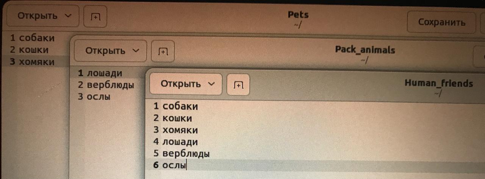
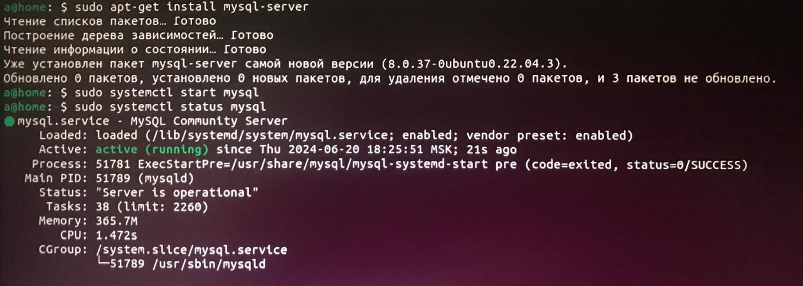

## 1. Использование команды cat в Linux
   - Создать два текстовых файла: "Pets"(Домашние животные) и "Pack animals"(вьючные животные), используя команду `cat` в терминале Linux. В первом файле перечислить собак, кошек и хомяков. Во втором — лошадей, верблюдов и ослов.
   - Объединить содержимое этих двух файлов в один и просмотреть его содержимое.
   - Переименовать получившийся файл в "Human Friends"(.
Пример конечного вывода после команды “ls” :
Desktop Documents Downloads  HumanFriends.txt  Music  PackAnimals.txt  Pets.txt  Pictures  Videos 

cat > Pets 
cat > Pack_animals 
cat Pets <(echo) Pack_animals > Human_friends 
cat Human_friends

## 2. Работа с директориями в Linux
   - Создать новую директорию и переместить туда файл "Human Friends".

mkdir union_dir 
mv Human_friends union_dir

## 3. Работа с MySQL в Linux. “Установить MySQL на вашу вычислительную машину ”
   - Подключить дополнительный репозиторий MySQL и установить один из пакетов из этого репозитория.

sudo wget https://dev.mysql.com/get/mysql-apt-config_0.8.23-1_all.deb 
sudo dpkg -i mysql-apt-config_0.8.23-1_all.deb 
sudo apt-get update 
sudo apt-get install mysql-server

## 4. Управление deb-пакетами
   - Установить и затем удалить deb-пакет, используя команду `dpkg`.

sudo apt update 
sudo apt upgrade 
https://downloads.vivaldi.com/stable/vivaldi-stable_3.8.2259.40-1_amd64.deb 

cd ~/Загрузки/ 
sudo dpkg -i vivaldi-stable_3.8.2259.40-1_amd64.deb 

vivaldi

sudo dpkg -r vivaldi-stable_3.8.2259.40-1_amd64.deb

